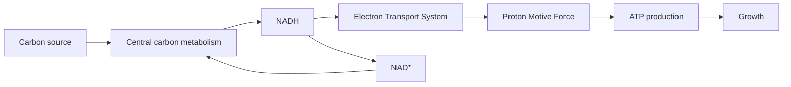

```mermaid
flowchart LR
    A["Carbon source"] --> B["Central carbon metabolism"]
    B --> C["NADH"]
    C --> D["Electron Transport System"]
    D --> E["Proton Motive Force"]
    E --> F["ATP production"]
    F --> G["Growth"]

    C --> H["NAD⁺"]
    H --> B
```
