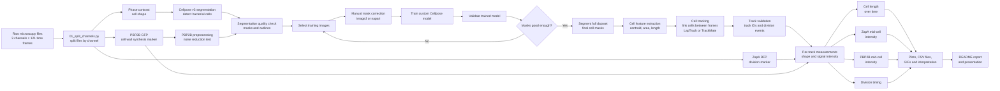

```mermaid
flowchart LR

    A[Raw microscopy files<br/>3 channels × 121 time frames] --> B[01_split_channels.py<br/>split files by channel]

    B --> C1[Phase contrast<br/>cell shape]
    B --> C2[ZapA RFP<br/>division marker]
    B --> C3[PBP2B GFP<br/>cell wall synthesis marker]

    C1 --> D[Cellpose v3 segmentation<br/>detect bacterial cells]
    C3 --> E[PBP2B preprocessing<br/>noise reduction test]

    D --> F[Segmentation quality check<br/>masks and outlines]
    E --> F

    F --> G[Select training images]
    G --> H[Manual mask correction<br/>ImageJ or napari]

    H --> I[Train custom Cellpose model]
    I --> J[Validate trained model]

    J --> K{Masks good enough?}

    K -- No --> G
    K -- Yes --> L[Segment full dataset<br/>final cell masks]

    L --> M1[Cell feature extraction<br/>centroid, area, length]

    M1 --> M2[Cell tracking<br/>link cells between frames<br/>LapTrack or TrackMate]

    M2 --> M3[Track validation<br/>track IDs and division events]

    M3 --> N[Per-track measurements<br/>shape and signal intensity]

    C2 --> N
    C3 --> N

    N --> O1[Cell length<br/>over time]
    N --> O2[ZapA mid-cell<br/>intensity]
    N --> O3[PBP2B mid-cell<br/>intensity]
    N --> O4[Division timing]

    O1 --> P[Plots, CSV files,<br/>GIFs and interpretation]
    O2 --> P
    O3 --> P
    O4 --> P

    P --> Q[README report<br/>and presentation]
```
